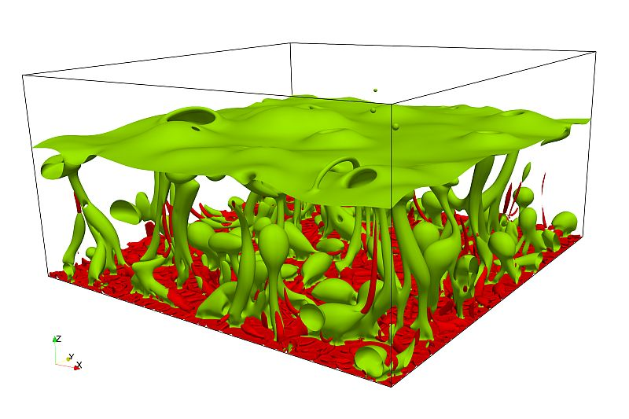

#demo-carousel.carousel.slide(data-ride='carousel')
  ol.carousel-indicators
    - var i = 0
      while i++ < 3
        if i == 1
          li.active(data-target='#demo-carousel', data-slide-to='' + i)
        else
          li(data-target='#demo-carousel', data-slide-to='' + i)
  .carousel-inner(role='listbox')
    - var i = 0
      while i++ < 3
        if i == 1
          .carousel-item.active(data-src='https://unsplash.it/800/400?random=' + i)
            .carousel-caption
              h3= 'Test caption ' + i
              p= 'Test caption description ' + i
        else
          .carousel-item(data-src='https://unsplash.it/800/400?random=' + i)
            .carousel-caption
              h3= 'Test caption ' + i
              p= 'Test caption description ' + i
  a.left.carousel-control(href='#demo-carousel', role='button', data-slide='prev')
    span.icon-prev(aria-hidden='true')
    span.sr-only Previous
  a.right.carousel-control(href='#demo-carousel', role='button', data-slide='next')
    span.icon-next(aria-hidden='true')
    span.sr-only Next

# end of first test

  <ol class="carousel-indicators">
    <li data-target="#carouselExampleIndicators" data-slide-to="0" class="active"></li>
    <li data-target="#carouselExampleIndicators" data-slide-to="1"></li>
    <li data-target="#carouselExampleIndicators" data-slide-to="2"></li>
  </ol>
  

    

      
    

    

      
    

    

      
    

  

  <a class="carousel-control-prev" href="#carouselExampleIndicators" role="button" data-slide="prev">
    
    Previous
  </a>
  <a class="carousel-control-next" href="#carouselExampleIndicators" role="button" data-slide="next">
    
    Next
  </a>

# try it here

$('.carousel').carousel()

shoud be done