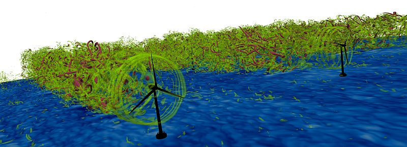

  <ol class="carousel-indicators">
    <li class="active" data-target="#demo-carousel" data-slide-to="1"></li>
    <li data-target="#demo-carousel" data-slide-to="2"></li>
    <li data-target="#demo-carousel" data-slide-to="3"></li>
  </ol>
  

    

      

        <h3>Test caption 1</h3>
        
Test caption description 1

      

    

    

      

        <h3>Test caption 2</h3>
        
Test caption description 2

      

    

    

      

        <h3>Test caption 3</h3>
        
Test caption description 3

      

    

  
<a class="left carousel-control" href="#demo-carousel" role="button" data-slide="prev">Previous</a><a class="right carousel-control" href="#demo-carousel" role="button" data-slide="next">Next</a>

# end of first test

  <ol class="carousel-indicators">
    <li data-target="#carouselExampleIndicators" data-slide-to="0" class="active"></li>
    <li data-target="#carouselExampleIndicators" data-slide-to="1"></li>
    <li data-target="#carouselExampleIndicators" data-slide-to="2"></li>
  </ol>
  

    

      
    

    

      
    

    

      
    

  

  <a class="carousel-control-prev" href="#carouselExampleIndicators" role="button" data-slide="prev">
    
    Previous
  </a>
  <a class="carousel-control-next" href="#carouselExampleIndicators" role="button" data-slide="next">
    
    Next
  </a>

# try it here

$('.carousel').carousel()

shoud be done